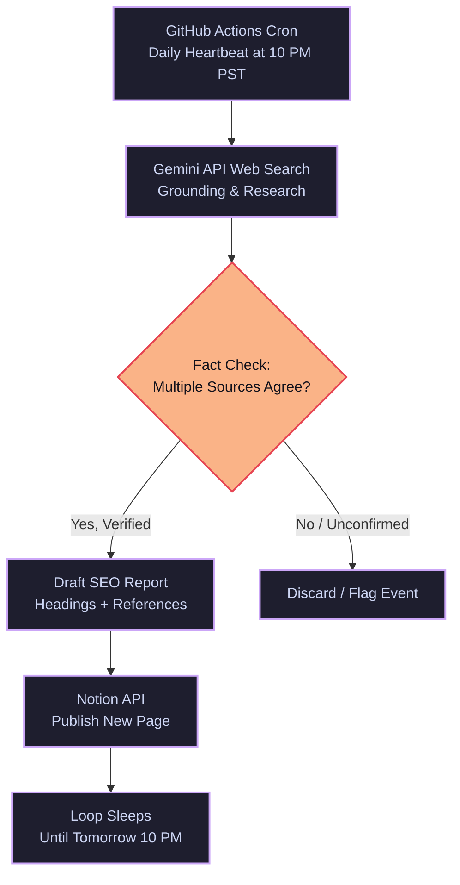

<div align="center">

# AI Daily Briefing → Notion

### Autonomous AI Research & Publishing Loop

**A self-running AI agent pipeline that researches, verifies, and publishes daily Artificial Intelligence news directly to Notion — fully automated, cloud-native, and zero-maintenance.**

[](https://github.com/features/actions)
[](https://ai.google.dev/)
[](https://developers.notion.com/)
[](https://www.python.org/)
[](#-license)
[](#)

</div>

---

## Overview

**AI Daily Briefing → Notion** is an autonomous **loop-engineered AI agent** that runs every single night — with **no laptop, no manual trigger, and no human intervention** — to deliver a professionally formatted, source-verified summary of the day's most important developments in:

- **Artificial Intelligence**
- **AI Agents & Agentic AI**
- **Forward Deployed Engineering**
- **AI Companies** (Anthropic & other major labs)
- **Trending AI Industry News**

The report is researched using **real-time web-grounded search**, cross-verified across **multiple trustworthy sources**, and automatically published as a beautifully structured page inside a **Notion workspace** — every day, on schedule, forever.

> **Why this matters:** This isn't a script that "guesses." It's an AI research pipeline built on verified loop-engineering principles — heartbeat, research, verification, and delivery — running entirely on cloud infrastructure.

---

## How It Works

```
          GitHub Actions Cron (Daily Heartbeat)
                        │
                        ▼
          Gemini API + Google Search Grounding
             (Multi-source research & verification)
                        │
                        ▼
          SEO-Optimized Markdown Report Generation
                        │
                        ▼
          Notion API (Auto-Publish to Workspace)
```

### System Architecture & Sequence Flow




| Stage | Technology | Purpose |
|-------|-----------|---------|
| **Heartbeat** | GitHub Actions (Cron) | Fires automatically every night — laptop-independent |
| **Research** | Gemini API + Search Grounding | Gathers real, verified information from multiple sources |
| **Content Generation** | Gemini (LLM) | Produces a clean, professional, SEO-optimized report |
| **Publishing** | Notion API | Creates a new page automatically in your workspace |

---

## Key Features

- ✅ **Fully Autonomous** — runs on a nightly schedule with zero manual effort
- ✅ **Cloud-Native** — powered by GitHub Actions, independent of any personal device
- ✅ **Multi-Source Verification** — cross-checks facts before publishing, avoiding misinformation
- ✅ **SEO-Optimized Formatting** — structured headings, clean hierarchy, and readable content
- ✅ **Reference-Backed Reporting** — every report includes a transparent Sources section
- ✅ **Secure by Design** — API keys stored via GitHub Secrets, never exposed in code
- ✅ **Notion-Native Publishing** — reports appear as clean, organized database entries

---

## Example Output

Each report is automatically titled using the following format:

```
August 30, 2026: AI Updates
```

**Structure of every report:**

1. SEO-friendly headline
2. Topic-based sections (Anthropic updates, Agentic AI, Industry news, etc.)
3. A verified **References** section citing real sources
4. Signature footer crediting the AI research agent

---

## Tech Stack

| Category | Tools Used |
|----------|-----------|
| Language | Python 3.11 |
| Automation | GitHub Actions |
| AI Model | Google Gemini API (with Search Grounding) |
| Publishing | Notion API |
| Secrets Management | GitHub Encrypted Secrets |

---

## Schedule Details

| Setting | Value |
|---------|-------|
| Cron (UTC) | `0 6 * * *` |
| Local Equivalent | 10:00 PM PST |
| Note | During PDT (Daylight Saving), this drifts by ~1 hour |

---

## Security Notes

- No API keys are ever hardcoded or committed to the repository
- All credentials are managed securely via **GitHub Encrypted Secrets**
- Secrets are automatically masked in workflow logs

---

## Developed By

<div align="center">

### **Muhammad Shariq**

[](https://www.linkedin.com/in/muhammad---shariq)

**Built as part of a hands-on Loop Engineering & Agentic AI learning journey — designing autonomous, production-grade AI systems.**

</div>

---

<div align="center">

⭐ **If you found this project interesting, consider giving it a star!** ⭐

</div>